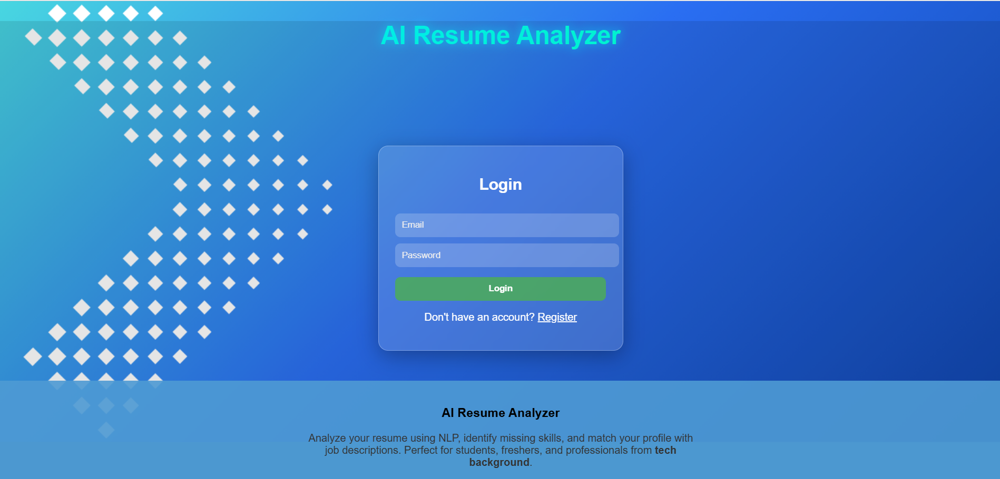
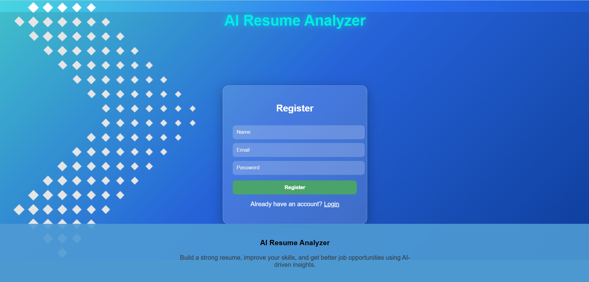
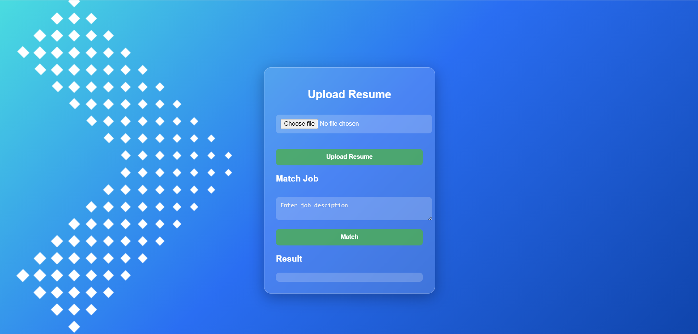
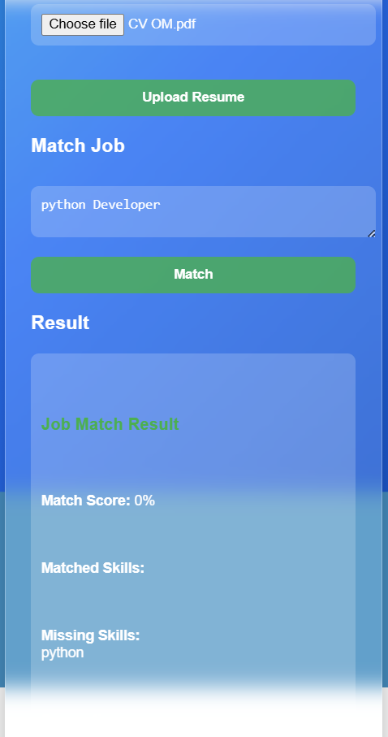

# 🤖 AI Resume Analyzer

AI Resume Analyzer is a web application developed as part of an MCA project that helps users analyze their resumes, identify missing skills,detect grammar issues, and improve their chances of getting shortlisted by matching resumes with job descriptions.

---

## 🚀 Features

- 📄 Upload and analyze resumes
- 🧠 Skill extraction from resume
- ✍️ Grammar checking
- 🎯 Job description matching
- 💡 Suggestions for improvement
- 🔐 Secure authentication (JWT)

---

## 🛠️ Tech Stack

- **Backend:** FastAPI  
- **Database:** PostgreSQL  
- **ORM:** SQLAlchemy  
- **Frontend:** HTML, CSS, JavaScript  
- **Authentication:** JWT  

---

## 📸 Screenshots

### 🔐 Login Page


### 📝 Register Page


### 📤 Upload Resume


### 📊 Resume Analysis


### 🎯 Job Match Result


---

## ⚙️ Installation

```bash
# Clone repository
git clone https://github.com/omkarkamble0101-ui/AI_RESUME_ANALYZER.git

# Go into folder
cd AI_RESUME_ANALYZER

# Install dependencies
pip install -r requirements.txt

# Run backend
uvicorn app.main:app --reload

# Run frontend
python -m http.server 5500

---

## API Endpoints

- POST /register
- POST /login
- POST /upload-resume
- POST /match-job

---

## Authors

- Omkar A. Kamble
- Sangramsinh N. Gurav
- Onkar C. Kate
